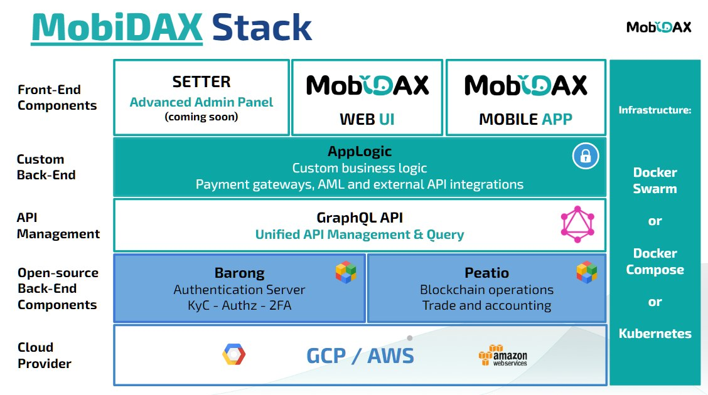

# MobiDAX

**MobiDAX** - World's First Cross-Platform Software Solution for deploying, customizing and maintaining Cryptocurrency and Fiat Trading Platforms. Developed on **Flutter** (by Google) Framework , MobiDAX is the only Cross-Platform solution that covers Web, iOS, Android Mobile and Desktop Applications from a **single code base**, with trader friendly UI and Native UX.


### Android Application Demo:


### IOS Application Demo:


### Mobidax is easily an highly customisable, so which Mobidax is yours ?


## Mobidax Roadmap

### 

### There are some great releases coming out soon, so stay tuned for those:

**1. Setter (Advanced Admin Panel)**

**2. Mobidax Web UI (Highly Customizable Trading Web UI)**


## Getting started

### VM requirements

Minimum:
 * 8GB to 12GB of RAM
 * 4 to 6 cores vCPU
 * 300GB SSD disk

DigitalOcean, Vultr, GCP, AWS or any dedicated servers Ubuntu, Debian, Centos would work

### Preparing the VM

#### Create Unix user
SSH using root user, then create new user for the application
```bash
useradd -g sudo -s `which bash` -m app
echo "app ALL=(ALL) NOPASSWD:ALL" >> /etc/sudoers 
```

#### Install Docker and docker compose

We highly recommend using docker and compose from docker.com install guide, do not use the system provided package
which would be deprecated.

Docker follow instruction here: [docker](https://docs.docker.com/install/)
Docker compose follow steps: [docker compose](https://docs.docker.com/compose/install/)

#### Add user to docker group 
```bash
sudo usermod -aG docker app
sudo su - app
cd opendax
```

#### Install ruby in user app

##### Change user using
```bash
su - app
```

##### Clone OpenDAX
```bash
git clone https://github.com/MobiDAX/opendax.git 
```

##### Install RVM
```bash
gpg --keyserver hkp://keys.gnupg.net --recv-keys 409B6B1796C275462A1703113804BB82D39DC0E3 7D2BAF1CF37B13E2069D6956105BD0E739499BDB
curl -sSL https://get.rvm.io | bash -s stable
cd opendax
rvm install .
source /home/app/.rvm/scripts/rvm
rvm install "ruby-2.6.3"
```

### Bundle install depedencies

```bash
bundle install
rake -T # To see if ruby and lib works
```

Using `rake -T` you can see all available commands, and can create new ones in `lib/tasks`

### Run everything

#### Configure your Domain
If using a VM you can point your domain name to the VM ip address before this stage.
Recommended if you enabled SSL, for local development edit the `/etc/hosts`

1. Get IP address of your VM 
2. Log in to DNS provider console
3. Set an A record for this IP to the corresponding domain name. 


Insert in file `/etc/hosts` (for local development)
```
0.0.0.0 www.app.local
```

#### Change configuration in `config/app.yml` 

Change all the configuration in app.yml related to your deployment.

```bash
vim config/app.yml
```
#### Authenticate in Github Container Registry

```bash
export PAT=*github_token*
docker login docker.pkg.github.com --username *your_github_username* --password-stdin
```

#### Bring up everything

```bash
rake service:all
```

You can login on `www.app.local` with the following default users from seeds.yaml
```
Seeded users:
Email: admin@barong.io, password: 0lDHd9ufs9t@
Email: john@barong.io, password: Am8icnzEI3d!
```

## Usage

### Initial configuration

All the OpenDax deployment files have their confguration stored in `config/app.yml`.

Feel free to fill it out with correct values:

| Parameter         | Description                                      |
| ----------------- | ------------------------------------------------ |
| `app.name`        | Global application name                          |
| `app.domain`      | Base domain name to be used                      |
| `ssl.enabled`     | Enable SSL certificate generation                |
| `ssl.email`       | Email address to use for SSL generation requests |
| `images`          | Application images tags                          |
| `vendor`          | Frontend application Git repo URL                |

Once you're done with the configuration, render the files using `rake render:config`. You can easily apply your changes at any time by running this command.

    Note: be sure to append all the subdomains based on app.domain to your
    /etc/hosts file if you're running OpenDax locally

### Bringing up the stack

The OpenDax stack can be brought up using two ways:

1. Bootstrap all the components at once using `rake service:all[start]`
2. Start every component one by one using `rake service:*component*[start]`

The components included in the stack are:

- `proxy` - [Traefik](https://traefik.io/), a robust cloud native edge router/reverse proxy written in Go
- `backend` - [Vault](https://www.vaultproject.io), [MySQL](https://www.mysql.com), [Redis](https://redis.io) and [RabbitMQ](https://www.rabbitmq.com) grouped together
- `cryptonodes` - cryptocurrency nodes such as [parity](https://github.com/paritytech/parity-ethereum) **[Optional]**
- `daemons` - Peatio daemons and Ranger **[Optional]**
- `setup` - setup hooks for Peatio and Barong to run before the application starts(DB migration etc.)
- `app` - [Peatio](https://github.com/rubykube/peatio), [Barong](https://github.com/rubykube/barong) and the [Envoy](https://envoyproxy.io) API gateway
- `frontend` - the frontend application located at `vendor/frontend`
- `tower` - the Tower admin panel application located at `vendor/tower`

For example, to start the `backend` services, you'll simply need to run `rake service:backend[start]`

    Note: all the components marked as [Optional] need to be installed using
    rake service:*component*[start] explicitly

Go ahead and try your deployment on www.your.domain!

### Stopping and restarting components

Any component from the stack can be easily stopped or restarted using `rake service:*component*[stop]` and `rake service:*component*[restart]`.

For example, `rake service:frontend[stop]` would stop the frontend application container and `rake service:proxy[restart]` would completely restart the reverse proxy container.

# Managing component deployments

Each component has a config file (ex. `config/frontend/tower.js`) and a compose file (ex. `compose/frontend.yaml`).

All config files are mounted into respective component container, except from `config/app.yml` - this file contains all the neccessary configuration of opendax deployment

Compose files contain component images, environment configuration etc.

These files get rendered from their templates that are located under `templates` directory.

## How to update component image?

Modify `config/app.yml` with correct image and run `rake:service[all]`
This will rerender all the files from `templates` directory and restart all the running services.

Alternitavely you can update the following files:
  * `config/app.yml`
  * `templates/compose/*component*.yml`
  * `compose/*component*.yml`
And run `rake service:component[start]`

## How to update component config?

Modify `config/*component*/*config*` and run `rake service:component[start]`,
if you want the changes to be persistent, you also need to update `templates/config/*components*/*config*`

#### Render compose file
```
# Delete all generated files
git clean -fdx

# Re-generate config from config/app.yml values
rake render:config

# Restart the container you need to reload config
docker-compose up frontend -Vd
```

#### Clone the vendors and start
```
source ./bin/set-env.sh
rake vendor:clone
docker-compose -f compose/vendor.yaml up -d
```

## Terraform Infrastructure as Code Provisioning

You can easily bring up Opendax from scratch on Google Cloud Platform using [Terraform](https://www.terraform.io)!

To do this, just follow these simple steps:
  - Fill `app.yml` with correct values
  - Run `rake terraform:apply`
  - Access your VM from the GCP Cloud Console
  - Have fun using it!

To destroy the provisioned infrastructure, just run `rake terraform:destroy`

## Installer tool

```
ruby -e "$(curl -fsSL https://raw.githubusercontent.com/MobiDAX/opendax/master/bin/install)"
```
